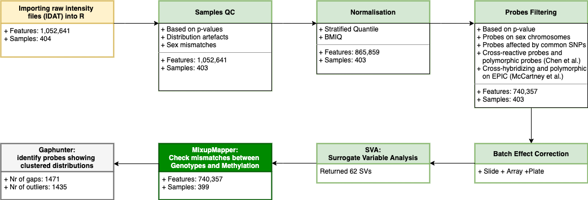

# __DEX-stimulated DNAm arrays processing__

_by Anastasiia Hryhorzhevska_

*Special thanks to Linda: https://github.com/LindaDi*

[Issues](#issues) 

[Brief introduction to DNAm array analysis](#brief-introduction-to-dnam-array-analysis)

[1. Input data](#1-input-data)

[2. Quality control check for samples](#2-qc)

[3. Normalization](#3-normalization)

[4. Probes filtering](#4-filtering)

[5. Batch effect correction](#5-batch-effect-correction)

[6. Surrogate Variable Analysis](#6-surrogate-variable-analysis-sva)

[7. MixupMapper](#7-mixupmapper)

[8. Gaphunter](#8-gaphunter)

[9. Cell types estimation](#9-cell-types-estimation)

[10. Methylation age estimation](#10-methylation-age-estimation)

[Final results](#the-final-results)

## **Issues**

__On cluster:__

1. Installation `minfi` : 

```R
Sys.setenv(LC_CTYPE="en_US.UTF-8")
Sys.setenv(LC_ALL="en_US.UTF-8")

BiocManager::install("minfi")

## OR

install.packages("remotes")
remotes::install_github("hansenlab/minfi")
````
or
```sh
export LC_CTYPE="en_US.UTF-8"
export LC_ALL="en_US.UTF-8"
```

## **Brief introduction to DNAm array analysis**

*from https://bioconductor.org/packages/devel/workflows/vignettes/methylationArrayAnalysis/inst/doc/methylationArrayAnalysis.html*

- For each CpG, there are two measurements: a methylated intensity (denoted by M) and an unmethylated intensity (denoted by U). These intensity values can be used to determine the proportion of methylation at each CpG locus. Methylation levels are commonly reported as either **beta** values (_β = M/(M+U)_) or **M**-values (_M-value = log2(M/U)_).

- For practical purposes, a small offset, α, can be added to the denominator of the β value equation to avoid dividing by small values, which is the default behaviour of the getBeta function in minfi. The default value for α is 100. It may also be desirable to add a small offset to the numerator and denominator when calculating M-values to avoid dividing by zero in rare cases, however the default getM function in minfi does not do this. 

- Beta values and M-values are related through a logit transformation. 

- **Beta values** are generally preferable for describing the level of methylation at a locus or for graphical presentation because percentage methylation is easily interpretable. However, due to their distributional properties, **M-values** are more appropriate for statistical testing 


The DNAm QC Roadmap



## **1. Input data:**

- iData data : `/binder/mgp/workspace/2020_DexStim_Array_Human/methylation/`
- RData: 

`/binder/mgp/datasets/2020_DexStim_Array_Human/methylation/`

* `rgSet_dex`: raw data from the dex IDAT files; organized at the probe (not CpG locus) level and has two channels (Red and Green).
    
The following data are obtained from __rgSet_dex__:

* `Mset_original`: data organized by the CpG locus level, but not mapped to a genome and has two channels, _Meth (methylated)_ and _Unmeth (unmethylated)_;
        
* `RatioSet_original`: data organized by the CpG locus level, but not mapped to a genome, and has at least one of two channels, _Beta_ and/or _M (logratio of Beta)_;
        
* `RawBetas`: _Beta_ values matrix, obtained from _RatioSet_;

* `gRatioSet_original`: the same as _RatioSet_ but mapped to a genome;

* `pd_original`: phenotype data

To get _rgSet_ and the rest of the data, run:

```sh
cd ~/01_prepare_data_formats/
chmod +x ./getRgSetFormats.sh
sbatch ./getRgSetFormats.sh
```

## **2. QC:**

1.  Calculate detection p-values. We can generate a detection p-value for every CpG in every sample, which is indicative of the quality of the signal. The method used by minfi to calculate detection p-values compares the total signal (_M_ + _U_) for each probe to the background signal level, which is estimated from the negative control probes. Very small p-values are indicative of a reliable signal whilst large p-values, for example _> 0.01_, generally indicate a poor quality signal.

2. Remove poor quality samples with a mean detection p-value _> 0.01_:

* from _rgSet_
* from _beta_ matrix
* from _p-values_ table
* from _targets_ table

_Result:_

**Data**

1. `rgSet_qc.Rdata`

2. `RawBetas_qc.Rdata`

3. `detP_qc.Rdata` : _p-values_ table;

**Reports:** `detectionP.pdf`, `qcReport.pdf`

3. Distribution artefacts

_Result:_

**Reports:** `03_beta_densities_report.pdf`

**Suspicious observations:**

* From array _R01C01_;

* Partially from _R03C01_;

* Sample _200712160065_.

4. Sex mismatches

By looking at the median total intensity of the X chromosome-mapped probes, denoted _xMed_, and the median total intensity of the Y-chromosome-mapped probes, denoted _yMed_, one can observe two different clusters of points corresponding to which gender the samples belong to. To predict the gender, minfi separates the points by using a cutoff on _log2(yMed)−log2(xMed)_. The default cutoff is −2. 

_Result:_

_The result should be cheked with genotype data_

**Data:** `sex_predicted.Rdata`

5. Remove sampleID found at the steps _3_ and _4_

_Result:_

**Data**

1. `rgSet_clean.Rdata`

2. `RawBetas_clean.Rdata`

3. `detP_clean.Rdata`

4. `pd_celan.Rdata`

5. `annotated_data_clean.Rdata`

## **3. Normalization:**

_Beta_ values were normalized using stratified quantile normalization (Touleimat & Tost, 2012), followed by BMIQ (Teschendorff et al., 2013). 

_Result:_

**Data**

Folder: `/binder/mgp/datasets/2020_DexStim_Array_Human/methylation/rData`:

1. `BMIQ.quantileN.Rdata`

2. `quantileN.Rdata`    

3. `quantileNBetas.Rdata`

4. `quantileNMs.Rdat`

5.  `BMIQ_quantileN.Rdata`

**Reports:** `BetaValue_Distributions_Norm_Quantile.pdf`

## **4. Filtering:**

The following probes in one or more samples were removed: 

- probes on _X_ or _Y_ chromosomes

- probes containing SNPs 

- cross-hybridizing and polymorphic probes according to Chen et al. (2013) 

- and McCartney et al. (2016)

- probes with a detection _p-value > 0.01_ 

_Result:_

**Data**

Folder: `/binder/mgp/datasets/2020_DexStim_Array_Human/methylation/rData`

1.  `quantileN_filtered.Rdata`

2. `BMIQ.quantileN_filtered.Rdata` 

3. `Betas_quantileN_filtered.Rdata`

4. `Ms_quantileN_filtered.Rdata`

**Reports:** `BetaValue_Distributions_Norm_quantile_Filter.png`

## **5. Batch effect correction:**

_Beta_ values were transformed into _M_-values, and batch-effects were removed using Combat. For this, principal component analysis (PCA) was performed on the M-values and then checked which batches were most strongly associated with the principal components (PCs). The strongest batches for the respective data set were iteratively removed. First, the the correction was done for _Plate_. Then, PCA was performed on corrected data and _p-values_ were computed. The results showed associaiton between PC2 and _Array_. Therefore, the correction was done for _Array_. And later, for _Slide_, since the was still strong association between PC2 and _Slide_.  Corrected _M_-values were re-transformed into _beta_ values. Attached pdf files shows the evaluation results after each step. Important to mention that the most variation was explained by DEX treatment. 

Result:_

**Data**

Folder: `/binder/mgp/datasets/2020_DexStim_Array_Human/methylation/rData`

1.  `Betas_combated.Rdata`:  normalized and batch-adjusted beta values df

2.  `Betas_combated_ExprSet.Rdata`:  expression set with normalized and batch-adjusted beta values

**Reports:** `/binder/mgp/datasets/2020_DexStim_Array_Human/methylation/14_reports/05_batch_effects_correction`

1. `00_PCA-map_ANOVA-res_before_correction.pdf`: PCA Individual Map, Density Plot for each batch, Group (dex or veh) and Gender before any batch correction, ANOVA summary statistics

2.  `01_PCA-map_ANOVA-res_PLATE_correction.pdf`: PCA Individual Map, Density Plot for each batch, Group (dex or veh) and Gender after correction on PLATE, ANOVA summary statistics

3.  `01_PCA-map_ANOVA-res_ARRAY_correction.pdf`: PCA Individual Map, Density Plot for each batch, Group (dex or veh) and Gender after correction on ARRAY, ANOVA summary statistics

4.  `01_PCA-map_ANOVA-res_SLIDE_correction.pdf`: PCA Individual Map, Density Plot for each batch, Group (dex or veh) and Gender after correction on SLIDE, ANOVA summary statistics

5.   `04_BetaComBated_Distributions_Plot.pdf`: Normalized and batch corrected beta distribution plots

## **6. Surrogate Variable Analysis (SVA):**

SVs were calculated using the R package __sva__ with the following design:

```r
mod0 <- model.matrix(~ 1 + individual_id, data = pheno)
mod  <- model.matrix(~ individual_id + Sample_Group, data = pheno)
```

Returned 62 SVs.


## **7. MixupMapper:**

More information for  methylation mixupmapping:
- https://github.com/molgenis/systemsgenetics/wiki/Methylation-mixupmapping

Required files description can be found here:
- https://github.com/molgenis/systemsgenetics/wiki/File-descriptions

**Data**

1. Methylation data :

    `/binder/mgp/datasets/2020_DexStim_Array_Human/methylation/mixupmapper`

2. SNPs:

    `/binder/mgp/datasets/2020_DexStim_Array_Human/snps/mixupmapper/`

#### _Initial step:_

1. Imputed genotypes: 

    `/binder/mgp/datasets/2020_DexStim_Array_Human/snps/Dex_genoData_SNPs.bed`

2. Batch-adjusted beta values: 

    `/binder/mgp/datasets/2020_DexStim_Array_Human/methylation/rData/Betas_combated.Rdata`

#### _Intermediate step:_

1. TRITYPER genotypes:    
    
    `/binder/mgp/datasets/2020_DexStim_Array_Human/snps/mixupmapper/`

2. Trait file: batch-adjusted beta values: 
    
    `/binder/mgp/datasets/2020_DexStim_Array_Human/methylation/mixupmapper/beta_combated_for_mixupmapper.txt`

3. Genotype - phenotype coupling: 
    
    `/binder/mgp/datasets/2020_DexStim_Array_Human/methylation/mixupmapper/genotypemethylationcoupling.txt`

**Run:**

1. Convert genotypes _.bed_ to _TriTyper_ format:

```sh
GENOTYPES_BED_DIR="/binder/mgp/datasets/2020_DexStim_Array_Human/snps/Dex_genoData_SNPs"
GENOTYPES_TRITYPER_DIR="/binder/mgp/datasets/2020_DexStim_Array_Human/snps/mixupmapper"

wget https://github.com/molgenis/systemsgenetics/releases/download/1.4.0_20-8.1/GenotypeHarmonizer-1.4.23-dist.tar.gz
tar -xvf GenotypeHarmonizer-1.4.23-dist.tar.gz
cd GenotypeHarmonizer-1.4.23

java -jar GenotypeHarmonizer.jar -i $DIR_GENOTYPES_BED -I PLINK_BED -o $DIR_GENOTYPES_TRITYPER -O TRITYPER  --update-id
```

2. Beta values normalization

```sh
screen -S mixupmapper

BETA_VALUES_FILENAME=/binder/mgp/datasets/2020_DexStim_Array_Human/methylation//mixupmapper/betas_combat_veh_mixupmapper_removed_mixups.txt
MIXUPMAPPER_DATA_DIR=/binder/mgp/datasets/2020_DexStim_Array_Human/methylation/mixupmapper/out_eqtl_normalization_removed_mixups
MIXUPMAPPER_DIR=/path/to/MixupMapper/eqtl-mapping-pipeline-1.2.4E-SNAPSHOT

# java -jar $MIXUPMAPPER_DIR/eqtl-mapping-pipeline.jar --mode normalize --in $BETAS_VALUE_FILENAME  --out $MIXUPMAPPER_DATA_DIR --centerscale
srun --part=pe -c 8 --mem=200G java -jar $MIXUPMAPPER_DIR/eqtl-mapping-pipeline.jar --mode normalize --in $BETA_VALUES_FILENAME --out $MIXUPMAPPER_DATA_DIR --centerscale
```

3. Run MixupMapper 

```sh
GENOTYPES_TRITYPER_DIR=/binder/mgp/datasets/2020_DexStim_Array_Human/snps/mixupmapper
TRAIT_NORM_FILENAME=/binder/mgp/datasets/2020_DexStim_Array_Human/methylation/mixupmapper/out_eqtl_normalization_removed_mixups/betas_combat_veh_mixupmapper_removed_mixups.ProbesCentered.SamplesZTransformed.txt.gz
ANNOTATION_FILENAME=/binder/mgp/datasets/2020_DexStim_Array_Human/methylation/mixupmapper/annotation.txt
COUPLING_FILENAME=/binder/mgp/datasets/2020_DexStim_Array_Human/methylation/mixupmapper/genotypemethylationcoupling_removed_mixups.txt
OUT_MIXUPMAPPER_DIR=/binder/mgp/datasets/2020_DexStim_Array_Human/methylation/mixupmapper/out_mixupmapper_removed_mixups

MIXUPMAPPER_DIR=/path/to/MixupMapper/eqtl-mapping-pipeline-1.2.4E-SNAPSHOT

srun --job-name="eqtl_mapping_pl" --part=pe --mem=200G --output=$OUT_MIXUPMAPPER_DIR/eqtl_mixupmapper.out java -Xmx30g -Xms30g -jar $MIXUPMAPPER_DIR/eqtl-mapping-pipeline.jar --mode mixupmapper --in $GENOTYPES_TRITYPER_DIR --out $OUT_MIXUPMAPPER_DIR --inexp $TRAIT_NORM_FILENAME --inexpplatform EPIC --inexpannot $ANNOTATION_FILENAME --gte $COUPLING_FILENAME
```

**Results:**

Two mix-ups were found


| Genotype |  OriginalLinkedTrait | OriginalLinkedTraitScore | BestMatchingTrait | BestMatchingTraitScore | Mixup |
| :---: | :---: | :---: | :---: | :---: | :---: |
| MPIPSYKL_007875 | 200712160042_R01C01  |    -4.9666422637773895  |   200720060022_R04C01 | -12.023177359249031 |  true |
| MPIPSYKL_007893 | 200720060022_R04C01 |     -5.231460612404898  |    200712160042_R01C01 |  -6.322773218809481 | true |

4. Remove the individuas (both dex and veh) that we setermined as mix-ups

**Results:**

The results data are the final data. Please look at the Final result section to get location where the data are stored.

## **8. Gaphunter:**

**Input Data**

* `dex_methyl_beta_combat_mtrx.rds` : final beta matrix after normalization, probes and samples filtering, batch correction and mix-ups removal _(740'357 x 399)_

**Result**

Folder: `/binder/mgp/datasets/2020_DexStim_Array_Human/methylation/13_gaphunter`:

* `gaphunter RDSs`:    R objects  
     - `dex_methyl_betas_mtrx_after_gap_outliers_na.rds`: beta matrix obtained from the beta combated matrix, _dex_methyl_beta_combat_mtrx.rds_, with all outliers detected as NAs 
     - `dex_methyl_betas_mtrx_after_gap_extreme_outliers_na.rds`:  beta matrix obtained from the beta combated matrix, _dex_methyl_beta_combat_mtrx.rds_, with additional NAs for __extreme__ outliers
     
* `01_Gaphunter_CpGs_Summary_threshold_0.05.csv`:  summary files for probes

* `02_Gaphunter_Samples_Summary_threshold_0.05.csv`:  summary files for samples


## **9. Cell types estimation:**

Biological findings in blood samples can often be confounded with cell type composition. In order to estimate the confounding levels between phenotype and cell type composition, we estimate the cell type composition of blood samples by using a modified version of the Houseman algorithm  (E Andres Houseman et al. 2012). Based on _FlowSorted.Blood.450k_. The function takes as input a RGChannelSet and returns a cell counts vector for each samples.

**Input Data**

* `dex_methyl_beta_combat_mtrx.rds` : final beta matrix after normalization, probes and samples filtering, batch correction and mix-ups removal _(740'357 x 399)_

**Result**

Folder: `/binder/mgp/datasets/2020_DexStim_Array_Human/methylation/11_cell_types_estimation`:

* `dex_stim_array_human_cellcounts.csv`: cell types estimation table

* `dex_stim_cell_type_estimation_plot.pdf`: plots the average DNA methylation across the cell-type discrimating probes within the mixed and sorted samples

## **10. Methylation age estimation:**

Methylation age can reflect a person’s biological age, which may be more related to the person’s health status than chronological age. 
Three different types of methylation age are estimated using methyAge: Horvath, Hannum and PhenoAge.

**Input Data**

* `dex_methyl_beta_combat_mtrx.rds` : final beta matrix after normalization, probes and samples filtering, batch correction and mix-ups removal _(740'357 x 399)_

**Result**

Folder: `/binder/mgp/datasets/2020_DexStim_Array_Human/methylation/12_DNAm_age`:

* `dex_stim_array_human_meth_age.csv`: table which contains DNAm age predicitons ( Horvath, Hannum and PhenoAge) and chronological age

* `DNAm_Age_and_Chronological_Age_Relation_plot.pdf`

## **The final results**

**Path on cluster :**

`/binder/mgp/datasets/2020_DexStim_Array_Human/methylation/`

and 

`/binder/common/methylation/qc_methylation/DexStim_EPIC_2020`

- `10_final_qc_data` : R objects  
    
    * `dex_methyl_phenotype.rds`: final phenotype data after excluding poor qc and mix-ups samples _(399 x 16)_
    * `dex_methyl_detP.rds`: final p-values matrix after excluding poor qc and mix-ups samples but not probes _(866'836 x 399)_
    * `dex_methyl_bmiq_quantileN.rds`: final beta matrix after quantile + BMIQ normalization, samples filtering and mix-ups removal _(865'859 x 399)_
    * `dex_methyl_bmiq_beta_mtrx.rds`: final beta matrix after BMIQ normalization, samples filtering and mix-ups removal _(862'805 x 399)_
    * `dex_methyl_bmiq_quantileN_filtered.rds`: final beta matrix after normalization, probes and samples filtering and mix-ups removal _(740'357 x 399)_
    * `dex_methyl_beta_combat_mtrx.rds`: final beta matrix after normalization, probes and samples filtering, batch correction and mix-ups removal _(740'357 x 399)_
    * `dex_methyl_beta_combat_exprset.rds`: final beta expression set after normalization, probes and samples filtering, batch correction and mix-ups removal _(740'357 x 399)_
    * `dex_methyl_rgset_final.rds`: final RGChannel Set after removing poor qc samples and mix-ups, number of probes is the same as in initial _(1'052'641 x 399)_

- `11_cell_types_estimation`:

    * `dex_stim_array_human_cellcounts.csv`: cell types estimation table
    * `dex_stim_cell_type_estimation_plot.pdf`: plots the average DNA methylation across the cell-type discrimating probes within the mixed and sorted samples

- `12_DNAm_age`:

    * `dex_stim_array_human_meth_age.csv`: table which contains DNAm age predicitons ( Horvath, Hannum and PhenoAge) and chronological age
    * `DNAm_Age_and_Chronological_Age_Relation_plot.pdf`

- `13_gaphunter`:

    * `gaphunter RDSs`:    R objects  
         - `dex_methyl_betas_mtrx_after_gap_outliers_na.rds`: beta matrix obtained from the beta combated matrix, _dex_methyl_beta_combat_mtrx.rds_, with all outliers detected as NAs 
         - `dex_methyl_betas_mtrx_after_gap_extreme_outliers_na.rds`:  beta matrix obtained from the beta combated matrix, _dex_methyl_beta_combat_mtrx.rds_, with additional NAs for __extreme__ outliers

- `14_reports`: Reports generated during processing the data

    The folder contains the set of folders with generated reports for particular step, e.g.:

    * `05_batch_effects_correction`: folder contains all reports generated during batch effect correction step:
        - `00_PCA-map_ANOVA-res_before_correction.pdf`
        - `01_PCA-map_ANOVA-res_PLATE_correction.pdf`
        - `02_PCA-map_ANOVA-res_ARRAY_correction.pdf`
        - `03_PCA-map_ANOVA-res_SLIDE_correction.pdf`    
        - `04_BetaComBated_Distributions_Plot.pdf`
        
**Notes:**

R objects generated during analysis are stored in the folder on cluster:

`/binder/mgp/workspace/2020_DexStim_Array_Human/methylation/rData`
